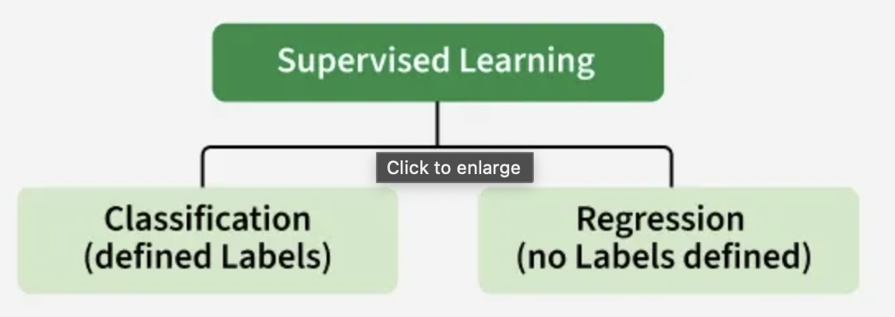

# Introduction to AI Concepts.

A collaborative guide by 
1. Markchege10-ux. 
2. Mshi-dev15.

## Table of Contents
- [Introduction](#introduction)
- [Machine Learning](#Machine-Learning)
- [Neural Networks](#Neural-Networks)
- [Deep Learning](#Deep-Learning)
- [Supervised Learning](#Supervised-Learning)
- [Unsupervisecd Learning](#Unsupervised-Learning)

## Introduction
This guide covers different concepts of AI.
Each section is written by a different team member and each team member should choose which 
topic to cover.

## Machine learning 
## Why Machine Learning Matters

Machine learning is useful when creating exact rules for a problem is difficult or impossible.

### Common Applications

- Email spam detection
- Fraud detection in banking
- Recommendation systems
- Medical diagnosis
- Image recognition
- Speech recognition
- Stock market analysis
- Self-driving cars

---

## Key Machine Learning Terminology

### Data

Data is the information used to train and test machine learning models.

Example:

| Age | Salary | Buy Product |
|------|---------|------------|
| 25 | 30,000 | No |
| 40 | 70,000 | Yes |

### Features

Features are the input variables used by a model.

Examples:
- Age
- Salary
- Location
- Experience

### Label (Target)

The output value the model is trying to predict.

Examples:
- Yes/No
- House Price
- Customer Churn

### Dataset

A collection of related data used for training and testing.

### Model

A mathematical representation learned from data that can make predictions.

### Training Data

Data used to teach the model.

### Testing Data

Data used to evaluate the model's performance.

---

## Types of Machine Learning

### 1. Supervised Learning

Supervised learning uses labeled data, meaning the correct answers are already known.

#### Examples

- House price prediction
- Email spam classification
- Disease diagnosis

#### Popular Algorithms

- Linear Regression
- Logistic Regression
- Decision Trees
- Random Forest
- Support Vector Machines (SVM)
- Neural Networks

---

### 2. Unsupervised Learning

Unsupervised learning works with unlabeled data and discovers hidden patterns.

#### Examples

- Customer segmentation
- Market basket analysis
- Anomaly detection

#### Popular Algorithms

- K-Means Clustering
- Hierarchical Clustering
- DBSCAN
- Principal Component Analysis (PCA)

---

### 3. Reinforcement Learning

Reinforcement learning trains an agent to make decisions through rewards and penalties.

#### Examples

- Game-playing AI
- Robotics
- Self-driving vehicles

#### Key Components

- Agent
- Environment
- Actions
- Rewards

---

### 4. Semi-Supervised Learning

Semi-supervised learning combines a small amount of labeled data with a large amount of unlabeled data.

#### Examples

- Image classification
- Speech recognition
- Medical imaging

## Useful Machine Learning Resources

### Official Documentation

- [Scikit-Learn Documentation](https://scikit-learn.org/stable/)
- [TensorFlow Documentation](https://www.tensorflow.org/)

---

## Neural networks  
A **neural network** is a machine learning model loosely inspired by how 
neurons in the brain connect and pass signals. It's the foundation behind 
most modern AI breakthroughs — from image recognition to ChatGPT.

### How They Work
- A network is made of **layers** of nodes ("neurons"): an **input layer**, 
  one or more **hidden layers**, and an **output layer**.
- Each connection between neurons has a **weight**, and each neuron has a 
  **bias** — these are the numbers the network adjusts as it learns.
- Data flows forward through the layers (**forward propagation**), and each 
  neuron applies an **activation function** (like ReLU or sigmoid) to decide 
  how strongly to "fire."
- The network compares its output to the correct answer using a **loss 
  function**, then adjusts its weights backward through the layers 
  (**backpropagation**) using **gradient descent** to reduce errors over time.

### Why They Matter
Neural networks can learn patterns directly from data instead of being 
explicitly programmed with rules. This makes them powerful for tasks that 
are hard to describe with fixed logic, such as:
- Recognizing faces or objects in photos
- Understanding and generating human language
- Detecting fraud in financial transactions
- Powering recommendation systems (Netflix, Spotify, etc.)

### Key Terms
- **Neuron** — a single computational unit that takes inputs, applies weights, and produces an output.
- **Activation Function** — adds non-linearity so the network can learn complex patterns, not just straight lines.
- **Epoch** — one full pass of the training data through the network.
- **Deep Learning** — neural networks with many hidden layers ("deep" networks).

### Useful Links
- [3Blue1Brown: Neural Networks (YouTube series)](https://www.3blue1brown.com/topics/neural-networks)
- [Neural Networks and Deep Learning (free online book)](http://neuralnetworksanddeeplearning.com/)

## Deep Learning
<!-- [paulinendugi.eng] will write this section -->

## Supervised learning
Supervised learning is a type of machine learning where a model learns from labelled data,
meaning each input has a correct output. The model compares its predictions with actual results and improves over time to increase accuracy.

  ## Types of supervised learning
  - Classification
  - Regression

  
  ## Advantages of Supervised learning
- When sufficient data is provided, it achieves high accuracy.
- Easy to understand and implement as it works on data labels.

## Disadvantages of Supervised learning
- heavily relly on dat fed hence can be tideous
- when minimall information is provided the output can be misleading

## Natural Language Processing
<!-- [Ngatia259-dev] will write this section -->

