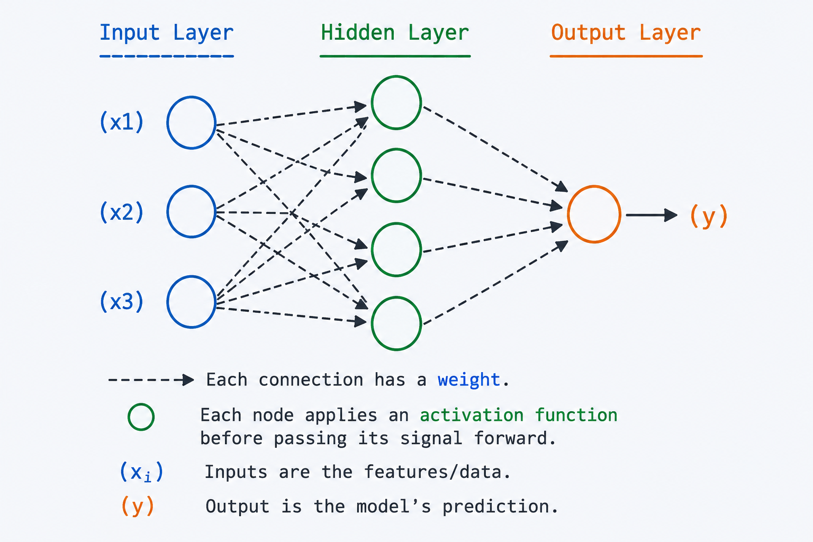

# Introduction to AI Concepts.

A collaborative guide by 
1. markchege10-ux
2. Mshi-dev15
3. M-0321
4. paulinendugi-eng
5. Ngatia259-dev

## Table of Contents
- [Introduction](#introduction)
- [Machine Learning](#Machine-Learning)
- [Neural Networks](#Neural-Networks)
- [Deep Learning](#Deep-Learning)
- [Supervised Learning](#Supervised-Learning)
- [Natural Language Processing](#Natural-Language-Processing)

## Introduction
This guide covers different concepts of AI.
Each section is written by a different team member and each team member should choose which 
topic to cover.

## Machine learning 
## Why Machine Learning Matters

Machine learning is useful when creating exact rules for a problem is difficult or impossible.

### Common Applications

- Email spam detection
- Fraud detection in banking
- Recommendation systems
- Medical diagnosis
- Image recognition

---

## Key Machine Learning Terminology

### Data

Data is the information used to train and test machine learning models.

Example:

| Age | Salary | Buy Product |
|------|---------|------------|
| 25 | 30,000 | No |
| 40 | 70,000 | Yes |

### Features

Features are the input variables used by a model.

Examples:
- Age
- Salary
- Location
- Experience

### Label (Target)

The output value the model is trying to predict.

Examples:
- Yes/No
- House Price
- Customer Churn

### Dataset

A collection of related data used for training and testing.

### Model

A mathematical representation learned from data that can make predictions.

### Training Data

Data used to teach the model.

### Testing Data

Data used to evaluate the model's performance.

---

## Types of Machine Learning

### 1. Supervised Learning

Supervised learning uses labeled data, meaning the correct answers are already known.

#### Examples

- House price prediction
- Email spam classification
- Disease diagnosis

#### Popular Algorithms

- Linear Regression
- Logistic Regression
- Decision Trees
- Random Forest

---

### 2. Unsupervised Learning

Unsupervised learning works with unlabeled data and discovers hidden patterns.

#### Examples

- Customer segmentation
- Market basket analysis
- Anomaly detection

#### Popular Algorithms

- K-Means Clustering
- Hierarchical Clustering
- DBSCAN
- Principal Component Analysis (PCA)

---

### 3. Reinforcement Learning

Reinforcement learning trains an agent to make decisions through rewards and penalties.

#### Examples

- Game-playing AI
- Robotics
- Self-driving vehicles

#### Key Components

- Agent
- Environment
- Actions
- Rewards

---

### 4. Semi-Supervised Learning

Semi-supervised learning combines a small amount of labeled data with a large amount of unlabeled data.

#### Examples

- Image classification
- Speech recognition
- Medical imaging

## Useful Machine Learning Resources

### Official Documentation

- [Scikit-Learn Documentation](https://scikit-learn.org/stable/)
- [TensorFlow Documentation](https://www.tensorflow.org/)

---

## Neural networks  
A **neural network** is a machine learning model loosely inspired by how 
neurons in the brain connect and pass signals. It's the foundation behind 
most modern AI breakthroughs — from image recognition to ChatGPT.

### How They Work
- A network is made of **layers** of nodes ("neurons"): an **input layer**, 
  one or more **hidden layers**, and an **output layer**.
- Each connection between neurons has a **weight**, and each neuron has a 
  **bias** — these are the numbers the network adjusts as it learns.
- Data flows forward through the layers (**forward propagation**), and each 
  neuron applies an **activation function** (like ReLU or sigmoid) to decide 
  how strongly to "fire."
- The network compares its output to the correct answer using a **loss 
  function**, then adjusts its weights backward through the layers 
  (**backpropagation**) using **gradient descent** to reduce errors over time.

### Why They Matter
Neural networks can learn patterns directly from data instead of being 
explicitly programmed with rules. This makes them powerful for tasks that 
are hard to describe with fixed logic, such as:
- Recognizing faces or objects in photos
- Understanding and generating human language
- Detecting fraud in financial transactions
- Powering recommendation systems (Netflix, Spotify, etc.)

### Key Terms
- **Neuron** — a single computational unit that takes inputs, applies weights, and produces an output.
- **Activation Function** — adds non-linearity so the network can learn complex patterns, not just straight lines.
- **Epoch** — one full pass of the training data through the network.
- **Deep Learning** — neural networks with many hidden layers ("deep" networks).

### Diagram

A simplified neural network showing how input features pass through hidden neurons and weighted connections to produce an output prediction.

### Useful Links
- [3Blue1Brown: Neural Networks (YouTube series)](https://www.3blue1brown.com/topics/neural-networks)
- [Neural Networks and Deep Learning (free online book)](http://neuralnetworksanddeeplearning.com/)

## Deep Learning

Deep learning is a specialized subset of **Machine Learning (ML)**, which itself is a branch of **Artificial Intelligence (AI)**. Inspired by the structure and function of the human brain, deep learning uses multi-layered artificial neural networks to learn deep hierarchies of data.

---

## 1. Core Concept:

At the heart of deep learning are **Artificial Neural Networks (ANNs)**. Unlike traditional machine learning algorithms that require manual feature engineering, deep learning algorithms automatically discover the features required for classification or prediction.

### The Basic Unit: The Perceptron
A perceptron (or neuron) takes multiple inputs, applies a weight to each, sums them up, adds a bias, and passes the result through an **activation function** to produce an output.

* **Inputs ($x_1, x_2, \dots, x_n$):** The data features fed into the neuron.
* **Weights ($w_1, w_2, \dots, w_n$):** Determine the importance/signal strength of each input.
* **Bias ($b$):** An extra threshold value added to the weighted sum to shift the activation function.
* **Activation Function:** Introduces non-linearity into the network, allowing it to learn complex patterns (e.g., ReLU, Sigmoid, Tanh).

The mathematical representation of a single neuron's output ($y$) is:

$$y = f\left( \sum_{i=1}^{n} w_i x_i + b \right)$$

---

## 2. Network Architecture

A "deep" neural network consists of three main types of layers:

1.  **Input Layer:** Receives the raw data (e.g., pixels of an image, words in a text).
2.  **Hidden Layers:** The "deep" part of deep learning. Multiple layers of neurons that extract increasingly abstract features. 
    * *Example in Vision:* The first hidden layer might detect edges; the second detects shapes; the third detects complex objects like faces.
3.  **Output Layer:** Provides the final prediction (e.g., "Cat" or "Dog", or a numerical value).

---

## 3. How Deep Learning Models Learn

The training process of a neural network involves an iterative loop of three main steps:

### A. Forward Propagation
Data passes through the network from the input layer to the output layer. Each layer processes the data and hands it to the next, resulting in a final prediction.

### B. Loss Function Evaluation
The model's prediction is compared to the actual target value (the truth) using a **Loss Function** (or Cost Function). The loss function calculates a error metric showing how far off the prediction was.
* *Common Loss Functions:* Mean Squared Error (MSE) for regression; Cross-Entropy for classification.

### C. Backward Propagation (Backpropagation) & Optimization
This is where learning actually happens:
* The error is calculated at the output and propagated *backward* through the network.
* Using **Calculus (The Chain Rule)**, the network calculates the gradient of the loss function with respect to each weight.
* An **Optimizer** (like Gradient Descent or Adam) adjusts the weights and biases in the direction that minimizes the loss.

---

## 4. Key Deep Learning Architectures

Different tasks require different network structures:

| Architecture Type | Best Used For | Key Feature |
| :--- | :--- | :--- |
| **Feedforward Neural Networks (FNN)** | Basic tabular data, classification | Standard layer-by-layer structure, no loops. |
| **Convolutional Neural Networks (CNN)** | Computer Vision, Image/Video Processing | Uses "filters" to capture spatial patterns in data. |
| **Recurrent Neural Networks (RNN / LSTM)**| Sequential Data, Time Series, Natural Language | Has "memory" loops to process historical sequences. |
| **Transformers** | Advanced NLP, Large Language Models (LLMs) | Uses "Self-Attention" mechanisms to process sequences simultaneously. |

---

## 5. Advantages and Challenges

### Advantages
* **No Manual Feature Engineering:** Automatically extracts features from raw data.
* **Highly Scalable:** Performance typically improves as you feed it more data and compute power.
* **Excellent with Unstructured Data:** Excels at handling images, audio, video, and text.

### Challenges
* **Data Hungry:** Requires massive amounts of labeled data to train effectively.
* **Compute Intensive:** Often requires specialized hardware like GPUs or TPUs.
* **Black Box Problem:** Deep networks are highly complex, making it difficult to interpret *why* a model made a specific decision.

## Supervised learning
Supervised learning is a type of machine learning where a model learns from labelled data,
meaning each input has a correct output. The model compares its predictions with actual results and improves over time to increase accuracy.

  ## Types of supervised learning
  - Classification
  - Regression

  ## Advantages of Supervised learning
- When sufficient data is provided, it achieves high accuracy.
- Easy to understand and implement as it works on data labels.

## Disadvantages of Supervised learning
- heavily relly on dat fed hence can be tideous
- when minimall information is provided the output can be misleading

## Natural Language Processing

**Natural Language Processing (NLP)** is a branch of artificial intelligence that focuses on enabling computers to understand, interpret, and generate human language. It bridges the gap between human communication and machine understanding, making it possible for us to interact with technology using everyday language instead of code.

### Why NLP Matters

Human language is incredibly complex — it is filled with ambiguity, slang, context, and emotion. NLP gives machines the ability to process this complexity at scale, powering many of the tools we use daily:

- **Virtual assistants** like Siri, Alexa, and Google Assistant
- **Machine translation** services like Google Translate
- **Email filtering** that separates spam from important messages
- **Chatbots** that provide customer support around the clock
- **Sentiment analysis** tools that gauge public opinion from social media

### How NLP Works

NLP combines techniques from **linguistics** and **computer science** to break down and analyze language. The typical NLP pipeline involves several stages:

1. **Tokenization** — Splitting text into individual words or tokens.
2. **Stop Word Removal** — Filtering out common words (e.g., "the", "is", "and") that carry little meaning.
3. **Stemming and Lemmatization** — Reducing words to their root form (e.g., "running" → "run").
4. **Part-of-Speech Tagging** — Identifying whether a word is a noun, verb, adjective, etc.
5. **Named Entity Recognition (NER)** — Detecting and classifying proper names, dates, locations, and organizations in text.
6. **Parsing** — Analyzing the grammatical structure of a sentence.

### Key NLP Techniques

| Technique | Description | Example Use Case |
| :--- | :--- | :--- |
| **Bag of Words (BoW)** | Represents text as a collection of word counts, ignoring order. | Document classification |
| **TF-IDF** | Weighs words by how important they are to a document relative to a collection. | Search engine ranking |
| **Word Embeddings (Word2Vec, GloVe)** | Maps words to dense numerical vectors that capture semantic meaning. | Finding similar words |
| **Transformers (BERT, GPT)** | Uses self-attention mechanisms to understand context in both directions. | Text generation, question answering |

### Real-World Applications

- **Healthcare** — Extracting information from medical records and research papers to assist doctors in diagnosis.
- **Finance** — Analyzing news articles and earnings reports to predict stock market trends.
- **Education** — Powering grammar checkers like Grammarly and automated essay scoring systems.
- **Legal** — Reviewing and summarizing large volumes of legal documents and contracts.
- **Social Media** — Monitoring brand reputation by analyzing the sentiment of user posts and reviews.

### Challenges in NLP

Despite remarkable progress, NLP still faces several challenges:

- **Ambiguity** — Words can have multiple meanings depending on context (e.g., "bank" can refer to a financial institution or the side of a river).
- **Sarcasm and Irony** — Detecting tone and intent is extremely difficult for machines.
- **Low-Resource Languages** — Most NLP models are trained on English; many languages lack sufficient training data.
- **Bias** — Models can inherit and amplify biases present in their training data.

### Useful Links

- [Stanford NLP Group](https://nlp.stanford.edu/)
- [Hugging Face — NLP Models and Datasets](https://huggingface.co/)
- [Speech and Language Processing (free textbook by Jurafsky & Martin)](https://web.stanford.edu/~jurafsky/slp3/)
- [Google Cloud Natural Language API](https://cloud.google.com/natural-language)
